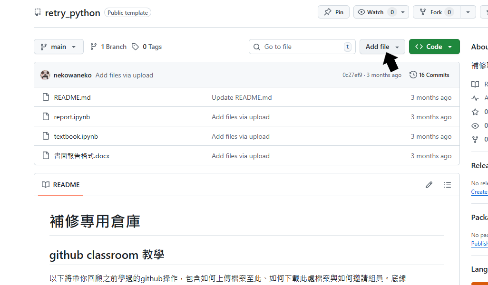
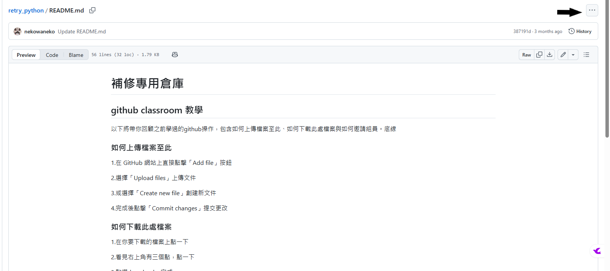

# Github classroom 使用教學

## 目錄
[前言](#前言)

[如何上傳檔案至此](#如何上傳檔案至此)

[如何下載此處檔案](#如何下載此處檔案)

[檔案取名格式(非常重要!!)](#檔案取名格式)

[如何邀請組員](#如何邀請組員)

## 前言
根據你們的選擇，點選以下連結來進行數據處理:

1. [選擇 LibreOffice Calc 進行數據處理](./README_calc.md)
2. [選擇 Python 進行數據處理](./README_python.md)

之後在完成推論與結論的學習單後，即可著手進行上台報告的簡報**pdf**，其規格如[report_structure.txt](./report_structure.txt)所示。簡報做好後，**一定**要上傳到此repo。

之所以選擇github，是因為可以避免 

1. 負責處理數據處理的組員沒來，又搞失蹤，導致整週沒進度。
2. 放在電腦上的資料被其他人刪光光(沒錯，有人做過)。

因此，學會github的部分功能可以避免上述兩個大麻煩，以下是幾個常用功能，若有興趣深入了解github，網路上很多教學。

## 如何上傳檔案至此
1.在 GitHub 網站上直接點擊「Add file」按鈕

2.選擇「Upload files」上傳文件

3.或選擇「Create new file」創建新文件

4.完成後點擊「Commit changes」提交更改

## 如何下載此處檔案
1.在你要下載的檔案上點一下

2.看見右上角有三個點，點一下

3.點選download，完成

## 檔案取名格式
如果你是二愛第二組，你們組的簡報(pdf)取名就是"二愛第二組"。

## 如何邀請組員
讓組員掃QRcode，並輸入你們的組名。
