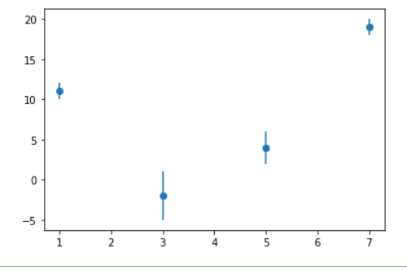

# github classroom 使用教學
能看到這行字，代表你已經辦好github帳號，並且受邀進到這裡。之後只要登入github，就能找到這裡。

接下來要做的事很簡單，就是將你們小組做實驗的Excel檔案，還有之後要做成簡報的素材(如學習單上的實驗裝置圖以及許多畫圖的部分)，上傳到這裡，這樣就不用擔心其他班的人把你們的資料刪光光了(沒錯，有人做過)。

## 如何上傳檔案至此
1.在 GitHub 網站上直接點擊「Add file」按鈕

2.選擇「Upload files」上傳文件

3.或選擇「Create new file」創建新文件

4.完成後點擊「Commit changes」提交更改

## 如何下載此處檔案
1.在你要下載的檔案上點一下

2.看見右上角有三個點，點一下

3.點選download，完成

## 檔案取名格式(非常重要!!)
如果你是二愛第二組，你們組的簡報(pdf)取名就是"二愛第二組"。

## 如何邀請組員
讓組員掃QRcode，並輸入你們的組名。

## 待辦事項
你們需要上網找有關LibreOffice Calc 的教學內容(不限文字或影片)，並完成以下任務:

- [ ] 將實驗結果輸入至LibreOffice Calc中。

- [ ] 在儲存格中寫下公式，透過LibreOffice Calc的技巧達到批量計算平均(全年級都要)、不確定度(理組)或標準差(文組)。

- [ ] 將表格中的內容做成x-y散佈圖(x對y平均)，並在圖上標記出誤差(不確定度或標準差)，最終結果應如下圖所示。

- [ ] 在x-y散佈圖上做出最適直線，找到R^2最大且次方低於2次方的方程式，並show出R^2與方程式。

- [ ] 補上x、y軸的單位，還有圖表標題。

- [ ] 將LibreOffice Calc存檔，並上傳至此。

## 數據處理任務
你們需要閱讀textbook.ipynb的內容，並將其實作於report.ipynb中，最後將你做的report.ipynb與做好的散佈圖上傳至此，我才能確認你們的進度。具體任務如下:

- [ ] 登入自己的google帳戶，打開google colab。
- [ ] 在github下載textbook.ipynb與report.ipynb，再分別上傳至colab。
- [ ] 將數據依照textbook.ipynb的內容輸入至report.ipynb並執行。
- [ ] 理論上會產生散佈圖的pdf檔案，將其從colab上下載後，再上傳至此。
- [ ] 將完成的report.ipynb上傳至此。
- 結束

想知道怎麼在框框中打勾，去上網找吧 ! 我可以給你提示，提示是mardown語法。
