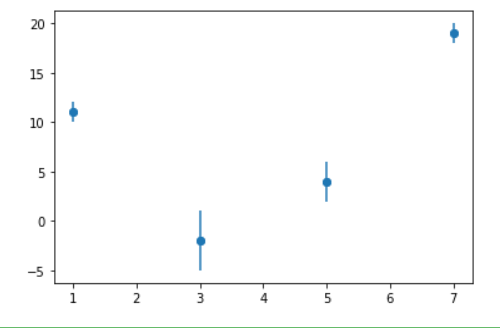

# 當你用LibreOffice Calc處理數據

## 數據處理任務
**你們需要上網找有關LibreOffice Calc 的教學內容(不限文字或影片)，並完成以下任務:**

- [ ] step 1 :將實驗結果輸入至LibreOffice Calc中。

- [ ] step 2 : 在儲存格中寫下公式，透過LibreOffice Calc的技巧達到批量計算平均(全年級都要)、不確定度(理組)或標準差(文組)。

- [ ] step 3 :將表格中的內容做成x-y散佈圖(x對y平均)，並在圖上標記出誤差(不確定度或標準差)，最終結果**應**如下圖所示。

- [ ] step 4 : 在x-y散佈圖上做出最適直線([何謂最適直線](https://zh.wikipedia.org/wiki/%E5%A4%9A%E9%A1%B9%E5%BC%8F%E5%9B%9E%E5%BD%92))，找到 $R^2$ ([何謂 $R^2$ ](https://zh.wikipedia.org/zh-tw/%E5%86%B3%E5%AE%9A%E7%B3%BB%E6%95%B0))最大且次方低於2次方的方程式，並show出 $R^2$ 與方程式。

- [ ] step 5 : 補上x、y軸的單位，還有圖表標題。

- [ ] step 6 : 將LibreOffice Calc存檔，並上傳至此。

- [ ] step 7 : 將你們的散佈圖想辦法變成圖片，使其可以在未來的簡報上縮放自如。

想知道怎麼在框框中打勾，去上網找吧 ! 我可以給你提示，提示是mardown語法。
