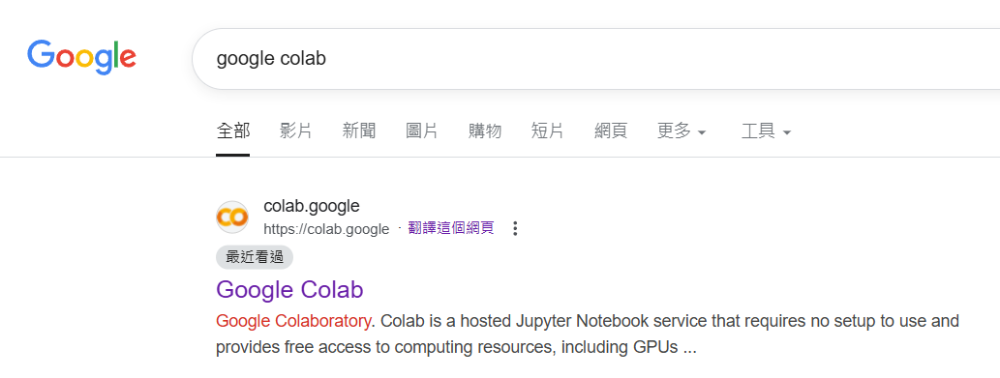
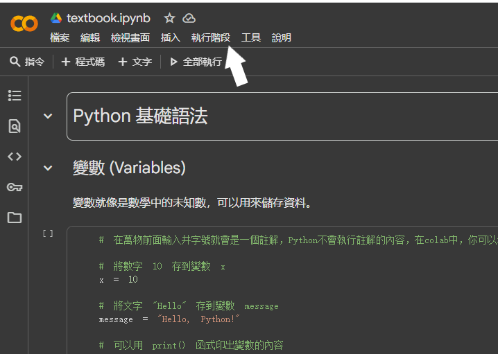

# 當你選擇python進行數據處理

## 數據處理任務
你們需要閱讀textbook.ipynb的內容，並將其實作於report.ipynb中，最後將你做的report.ipynb與做好的散佈圖上傳至此，我才能確認你們的進度。具體任務如下:

- [ ] step 1 : 登入自己的google帳戶，打開google colab。

- [ ] step 2 : 在github下載textbook.ipynb與report.ipynb，再分別上傳至colab。

- [ ] step 2.5 : 閱讀一下report.ipynb，才知道要從textbook.ipynb中複製哪些內容。 

- [ ] step 3 : 將數據依照textbook.ipynb的內容輸入至report.ipynb。

- [ ] step 3.5 : 在report.ipynb裡點選執行階段中的全部執行。

- [ ] step 4 : 解決一個一個一個的bug。(惱)

- [ ] step 5 : 理論上會產生散佈圖的png檔案，並放在左側的資料夾，將其從colab下載後，再上傳至此repo。

- [ ] step 6 : 將完成的report.ipynb上傳至此。

- 結束

想知道怎麼在框框中打勾，去上網找吧 ! 我可以給你提示，提示是mardown語法。
